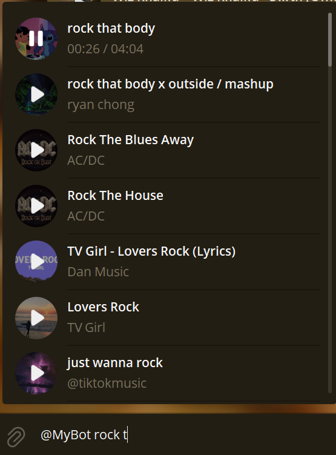

# Telegram Music Bot: YouTube Audio Downloader

<div align="center">

</div>

<br>

> No slashes, no complex commands, and no reliance on cumbersome song links

## ⚡ Features Summary

* **⚡ Fast Downloads:** Get your audio tracks delivered in just **5–15 seconds**.
* **📥 Inline Search (v1.1.0):** Search tracks instantly within the bot's internal databases without downloading from YouTube.
* **📦 Self-Updating Music Archive (v1.1.0):** Tracks sent to the storage channel are automatically indexed, de-duplicated, and ready for instant reuse.


* **🧹 Clean Interface:** Bot auto-deletes the user command, keeping your chat tidy.

* **🔎 Simple Command:** Use the direct **`music <song name>`** format for instant search.

* **💡 Intelligent Metadata:** Interactive button displays rich track details (author, views, likes, etc.).

* **🔄 Instant Alternatives:** Found the wrong version? A quick button allows re-selection from the top 10 search results.

* **🛡️ Robust & Stable:** Features built-in limits on file size/duration and a strong anti-spam system.


## 📸  Workflow

### 1. Song Download and Interactive Buttons


* **(`🎵 Requester Name`)**: Click to view detailed information about the song
* **(`🔎 Not the right song?`):** Click to view alternative versions.

<p align="center">
    
</p>

### 2. Detailed Song Metadata

Clicking the requester's name reveals a detailed pop-up alert containing statistics and metadata.
* **Custom Fact:** Includes a random, funny/interesting music history fact.

<p align="center">
    
</p>

### 3. Alternative Search

If the first track is incorrect, the right button replaces the message buttons with a list of the next 10 search results for quick selection.

<p align="center">
    
</p>

### 4. Inline Mode 

Use Telegram inline mode anywhere:

<p align="center">
    
</p>


## 🛠️ Technical Highlights

1.  **Zero-Conversion (Maximum Speed):** The bot leverages Telegram's ability to play various audio formats by simply **renaming the extension to `.mp3`**. This eliminates CPU-heavy transcoding (no FFMpeg dependency).

2.  **Asynchronous Core:** Built on the high-performance `aiogram`.

3. The yt-dlp core is automatically checked and updated upon bot restart (default 24h). Update frequency is customizable in core/yt_dlp_update/yt_dlp_manager.py via EXPIRATION_SECONDS.

4. **Separated Audio Databases (Key-Based Storage):**  
   Audio references are stored as **Telegram `file_id` keys**, not raw files.

   - `music_channel.db` — primary, curated storage populated from a private channel  
     • MP3-only validation
     • It’s filled manually (by uploading songs to the channel)
     • Duplicate and near-duplicate detection  
     • Acts as a long-term, clean audio source

   - `music_chat.db` — dynamic cache populated from user-triggered downloads  
     • Automatically filled on `music` usage  
     • It uses the chats it’s added to as sources for audio files
     • Grows naturally with real usage


## ⚙️ Customization (via `core/strings.py`)

The bot's interface and command structure can be fully customized by editing **`core/strings.py`**:

* **Command Prefix:** Change the bot's command trigger (e.g., replace `"music "` with `"search "` or `"download "`) by modifying the `COMMAND_PREFIX` variable.

* **Interface Language:** Change the bot's entire language interface by translating variables like `STATUS_SEARCHING`, `ERROR_PREFIX`, and all button texts.

* **Fun Facts/Taglines:** You can easily update the **list of random facts (`tagline`)** that appear at the bottom of the song information message.

---

### 📂 File Structure


```bash
│   main.py                   # Start 
│
├───core/
│   │   config.py             # Config, limits, logging
│   │   strings.py            # Text messages & constants
│   │
│   ├───handlers/
│   │   │   callbacks.py      # Button press handling 
│   │   │   messages.py       # Text command handling
│   │   │   channel_posts.py  # Auto-indexing from storage channel
│   │   │   inline_mode.py    # Inline query aggregation
│   │
│   ├───services/
│   │   │   storage.py        # Cache management, song metadata
│   │   │   youtube.py        # YouTube search, download, metadata
│   │   │ 
│   │   └───inline_search/
│   │           database.py       # SQLite CRUD (aiosqlite)
│   │           fts5_search.py    # Full-text search
│   │           rapidfuzz_search.py # Fuzzy matching
│   │
│   └───yt_dlp_update/        
│           yt_dlp_manager.py # yt-dlp auto-updater 
│
├───data/
│   │   .env                  # BOT_TOKEN, limits, etc. 
│   │   bot.log               # ERROR log file
│   │   songs_cache.db        # Cache metadata file 
│   │   music_channel.db      # Primary storage channel index; holds persistent track keys
│   │   music_chat.db         # Dynamic user/download cache; stores track keys from chats  
```


## ⚙️ Configuration

Set up your bot by creating a `data/.env` file and filling out the necessary parameters:

| Variable | Description | Default / Example |
| :--- | :--- | :--- |
| `BOT_TOKEN` | Telegram Bot Token from BotFather. | `YOUR_BOT_TOKEN` |
| `ALLOWED_CHAT_ID` | Access control: comma-separated list of Chat IDs. <br>• **Empty:** all public chats allowed<br>• **false:** restricted from all public chats | `-100123456789,` |
| `ALLOW_PRIVATE_CHAT` | Enable/disable bot usage in private chats (DMs). | `true` |

###  Limits
| Variable | Description | Default / Example |
| :--- | :--- | :--- |
| `MAX_FILE_SIZE_MB` | Maximum allowed file size (MB). | `50` |
| `MAX_SONG_DURATION_MIN` | Maximum allowed song duration (minutes). | `15` |
| `CONCURRENT_DOWNLOAD_LIMIT` | Maximum simultaneous downloads (async semaphore). | `5` |

### Security / Access

| Variable | Description | Default / Example |
| :--- | :--- | :--- |
| `BLOCKED_USER_IDS` | Comma-separated Telegram User IDs to block. | `1234567890,` |


### Spam Protection

| Variable | Description | Default / Example |
| :--- | :--- | :--- |
| `ANTI_SPAM_INTERVAL` | Minimum pause between requests from one user (seconds). | `15` |
| `ANTI_SPAM_CALLBACK_INTERVAL` | Minimum pause between button callback actions from one user (seconds). | `1` |


### File Management / Cache

| Variable | Description | Default / Example |
| :--- | :--- | :--- |
| `SONGS_INFO_FILE` | File used by `storage.py` for cached song metadata. | `songs_info.json` |
| `INFO_EXPIRATION_HOURS` | Expiration time for song cache (hours). | `10` |
| `MUSIC_STORAGE_CHANNEL_ID` | Private channel ID for storing/indexing music. Leave empty to disable. | `-1001234567890` |

## 🚀 Installation & Run
### Requirements:
- Python 3.10+
### Quick Setup for MUSIC_STORAGE_CHANNEL_ID
`optional`
1. Create a private channel and give your bot admin rights.  
2. Set `MUSIC_STORAGE_CHANNEL_ID` to the channel's ID in `.env`.  
3. Send or forward music to this channel for persistent indexing.

### Linux
1.  **Clone the repository and navigate to the Linux folder:**
    ```bash
    git clone https://github.com/eug0x/telegram_music_bot
    cd telegram_music_bot/telegram_bot_linux
    ```

2.  **Install dependencies:**
    ```bash
    pip install -r requirements.txt
    ```

3.  **Setup Environment:**
    ```bash
    cd data
    mv env .env
    nano .env
    ```
    - In the opened `.env` file, add your bot token:
    ```text
    BOT_TOKEN=14566BLABLABLA
    ```
    - Save and exit (`Ctrl+O`, `Enter`, `Ctrl+X`).
     ```bash
    cd ..
    ```

4.  **Run the bot:**
    ```bash
    python main.py
    ```

---

### Windows

1.  **Clone the repository:**
    ```bash
    git clone https://github.com/eug0x/telegram_music_bot
    cd telegram_music_bot
    ```

2.  **Install dependencies:**
    ```bash
    pip install -r requirements.txt
    ```

3.  **Setup Environment:**
    Set up data/.env and put your BOT_TOKEN inside.

4.  **Run the bot:**
    ```bash
    python main.py
    ```


