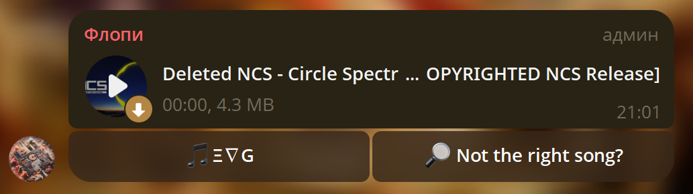
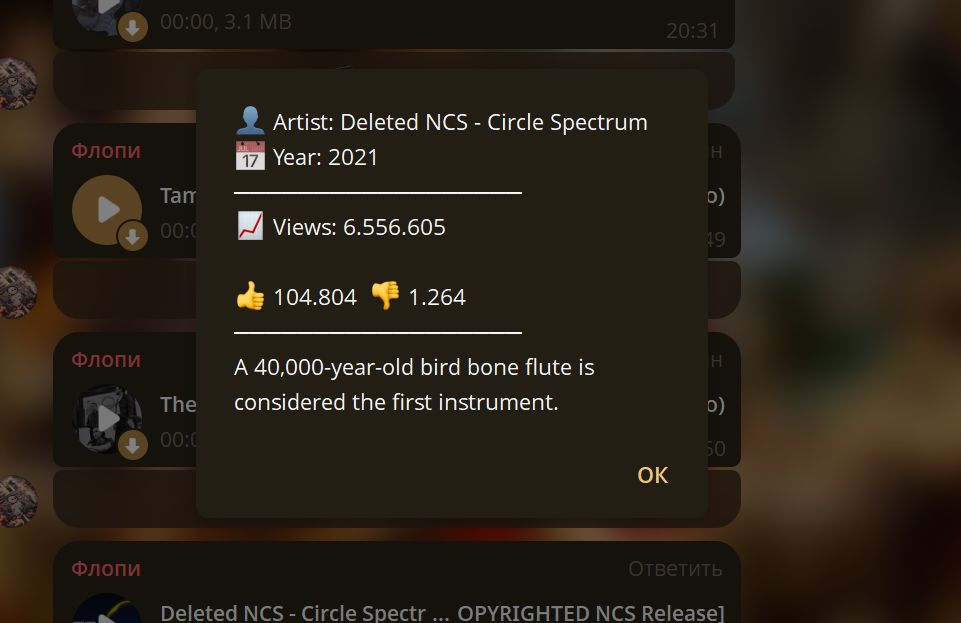

# Telegram Bot: YouTube Audio Downloader

<div align="center">

</div>

<br>


## ⚡ Features

- **Fast Delivery:** Audio tracks are typically delivered in **5–15 seconds**, depending on network conditions and file size.
- **Intuitive Command:** Uses the simple `music <song name>` command to initiate the search and download process.
- **Clean Chat Interface:** Automatically deletes the user's input message, leaving only the bot's response.
- **Detailed Song Info:** Interactive button displays rich metadata about the track, including author, year, views, likes, and a fun fact.
- **Alternative Search:** If the song downloaded is not the right version (e.g., a remix or cover), a button is available for quick re-search and selection from the top 10 results.
- **Anti-Spam & Robust Limits** Built-in limits on file size, duration, and user request intervals.


## 📸  Workflow

### 1. Song Download and Interactive Buttons


* **(`🎵 Requester Name`)**: Click to view detailed information about the song
* **(`🔎 Not the right song?`):** Click to view alternative versions.

<p align="center">
    
</p>

### 2. Detailed Song Metadata

Clicking the requester's name reveals a detailed pop-up alert containing statistics and metadata.
* **Custom Fact:** Includes a random, funny/interesting music history fact.

<p align="center">
    
</p>

### 3. Alternative Search

If the first track is incorrect, the right button replaces the message buttons with a list of the next 10 search results for quick selection.

<p align="center">
    
</p>


## 🛠️ Technical Highlights

The primary goal of this bot is **speed and resilience**. It achieves this using three key methods:

1. **Zero-Conversion (Telegram Feature Exploitation):** The bot fully exploits the fact that **Telegram will play any recognized audio format** if the file extension is simply renamed to `.mp3`. This eliminates the need for CPU-heavy FFMpeg transcoding, resulting in a **near-instantaneous processing time** after the download completes.

2.  **Asynchronous Processing:** Built using the `aiogram` framework for high-performance concurrent request handling.
3. **Self-Updating Dependency Manager 🔄:** Located in **`core/yt_dlp_manager.py`**, this module ensures **`yt-dlp`** is always current. It checks the file's modification time (not the version) on startup, and automatically updates if it's older than **24 hours** (customizable via `EXPIRATION_SECONDS`).
4. **Protected Interface (User-Specific Buttons):** All inline keyboard actions (Cancel, Not Right Song, etc.) are **user-specific** and will only respond to the user who initiated the command.

## ⚙️ Customization (via `core/strings.py`)

The bot's interface and command structure can be fully customized by editing **`core/strings.py`**:

* **Command Prefix:** Change the bot's command trigger (e.g., replace `"music "` with `"search "` or `"download "`) by modifying the `COMMAND_PREFIX` variable.
* **Interface Language:** Change the bot's entire language interface by translating variables like `STATUS_SEARCHING`, `ERROR_PREFIX`, and all button texts.
* **Fun Facts/Taglines:** You can easily update the **list of random facts (`tagline`)** that appear at the bottom of the song information message. Add your own list of funny or interesting musical trivia to personalize the bot's output

---

### 🚨 Scalability Note

The bot currently **does not utilize a Semaphore**  Therefore, it is currently best suited for **private chats or groups with up to 100 members (Optimization for larger groups is planned for future updates.)**. 


## ⚙️ Configuration

Set up your bot by creating a `data/.env` file and filling out the necessary parameters:

| Variable | Description | Default / Example |
| :--- | :--- | :--- |
| `BOT_TOKEN` | Your Telegram Bot Token from BotFather. | `YOUR_BOT_TOKEN` |
| `ALLOWED_CHAT_ID` | Access control. Comma-separated list of Chat IDs. <br>• **Empty:** Allowed in ALL public chats.<br>• **`false`:** Restricted from all public chats. | `false` |
| `ALLOW_PRIVATE_CHAT`| Enables/disables usage in private chats (DMs). | `true` |
| `MAX_FILE_SIZE_MB` | Maximum allowed file size for download (in MB). | `50` |
| `MAX_SONG_DURATION_MIN`| Maximum allowed song duration (in minutes). | `15` |
| `ANTI_SPAM_INTERVAL` | Minimum pause between requests from one user (in seconds). | `15` |
| `INFO_EXPIRATION_HOURS`| Cache expiration time for song data to manage memory. | `10` |
| `BLOCKED_USER_IDS` | Comma-separated list of Telegram User IDs to block. | (empty) |

---

## 🚀 Installation & Run

1.  **Clone the repository:**
    ```bash
    git clone [https://github.com/zhenyaandroshchuk-blip/Floppy_Music_Bot.git]
    cd FloppyMusicBot
    ```

2.  **Install dependencies:**
    ```bash
    pip install -r requirements.txt
    ```

3.  **Setup Environment:**
    Create and configure the `data/.env` file based on the table above.

4.  **Run the bot:**
    ```bash
    python main.py
    ```
    *(The `yt-dlp` executable will be downloaded automatically on the first run.)*
